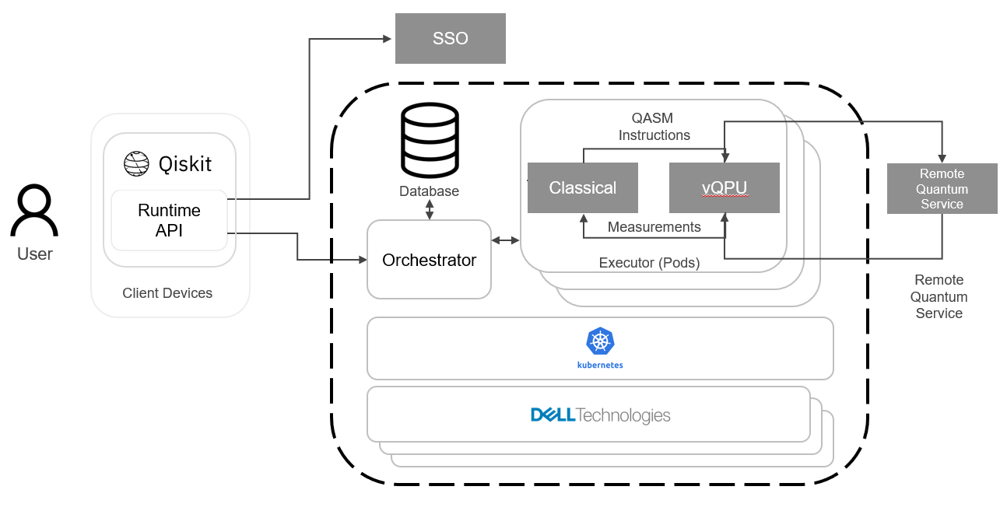

# Qiskit Dell Runtime
Qiskit Dell Runtime is a [Qiskit Runtime](https://github.com/Qiskit-Partners/qiskit-runtime) platform that can execute classical-quantum code on both local and on-premise environments. With this platform, hybrid classical-quantum code bundle can be developed and executed. Powered by Qiskit Runtime API, this execution model provides close-integration of classical and quantum execution. 

Various simulation, emulation and quantum hardware can be integrated with this platform. Developers can abstract their source code with Qiskit, so that execution can be ported across execution environments with minimum effort. 

## Architecture
This platform provides both client-side provider and server-side components. 

### Client-side Provider
Users would need to install the `DellRuntimeProvider` on client devices. The provider is defaulted to local execution and can be used out of the box. This provider can also be used to connect with platform running on a server-side, so that users can control server and execute jobs by using the same API. 

### Server-side Components
This platform has a minimalist design to create a light-weighted execution environment for server-side components. It contains an `orchestrator` long-running microservice that listens to requests from `DellRuntimeProvider`. 

At runtime, when a job is started by user, a new pod will be created to execute both classical and vQPU workload. 

For deployment installation, please visit this [link](doc/install.md). 

### Database Configuration
All user-uploaded code and execution parameters will be stored in a database. By default, this platform comes with a [mysql](https://www.mysql.com/) deployment. If users would like to customize database to another database service, please view these installations for database configuration. 

### SSO
SSO integration is off by default, so that users can easily set up a sandbox environment. There is existing integration hooks built into the platform for easy integration with various SSO systems. 

### Multi-Backend Support
By default, the quantum execution will be processed by [Qiskit Aer](https://github.com/Qiskit/qiskit-aer) simulation engine. Users can modify the quantum backend by specifying `backend-name` in the job input parameter. Custom code adjustment can be made to support multiple [Qiskit backends](https://qiskit.org/documentation/stubs/qiskit.providers.ibmq.IBMQBackend.html), including other emulation, simulation and QPU backends. 

## Emulation vs Simulation
While simulation engines execute quantum circuits to measure probablistic outcome, emulation engines calculate outcome for algorithms with deterministic calculations. 

**The Hybrid Emulation Platform can support both simulation and emulation,** depending on the backend used. 

You can read about the VQE example provided in [our documentation](examples.ipynb) or in a [Qiskit Tutorial](https://qiskit.org/documentation/tutorials/algorithms/04_vqe_advanced.html) if you want to learn more about when it may be beneficial to use either emulation or simulation over the other.

Emulations for different use cases are under-development, and we are looking for feedback to better prioritize on use cases. If you have a use-case in mind, please contact us at [v.fong@dell.com](mailto:v.fong@dell.com).

## Documentation Links:
- [Introduction](doc/intro.md)
- [Installation Guide](doc/install.md)
  - [Requirements](doc/install.md#requirements)
  - [Client Quick Start Guide](doc/install.md#client-quick-start-guide)
  - [Server Quick Start Guide](doc/install.md#server-quick-start-guide)
  - [Configuring Custom SSO](doc/install.md#configuring-custom-sso)
  - [Configuring Custom Database](doc/install.md#configuring-custom-database)
- [Usage](doc/usage.ipynb)
  - [Local Execution Setup](doc/usage.ipynb)
  - [Remote Execution Setup](doc/usage.ipynb)
  - [Program Upload](doc/usage.ipynb)
  - [Execution](doc/usage.ipynb)
    - [Obtaining Results](doc/usage.ipynb)
  - [(Optional) Callback Function](doc/usage.ipynb)
  - [(Optional) Backend Selection](doc/usage.ipynb)
- [Examples](doc/examples.ipynb)
  - [Local Execution](doc/examples.ipynb)
  - [Remote Execution](doc/examples.ipynb)
  - [QKA](doc/examples.ipynb)
  - [VQE](doc/examples.ipynb)

For any questions or feedback, please contact [v.fong@dell.com](mailto:v.fong@dell.com)